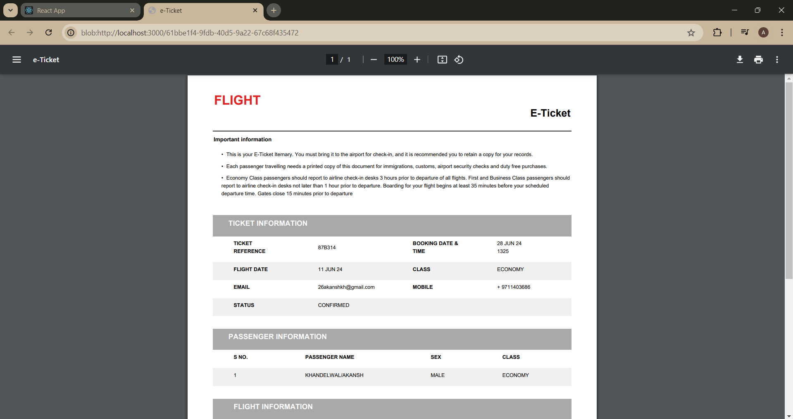

<p align="center">
  <a href="" rel="noopener">
 </a>
</p>

<h3 align="center">AeroReserve - Effortless Flight Booking at Your Fingertips</h3>


---

<p align="center">A Flight Booking Web Application for seamless flight booking experience
    <br> 
</p>

## 📝 Table of Contents

- [About](#about)
- [Getting Started](#getting_started)
- [Usage](#usage)
- [Built Using](#built_using)
- [Authors](#authors)

## 🧐 About <a name = "about"></a>

AeroReserve is an innovative flight booking platform designed to streamline the process of searching for and reserving flights with ease. 

Utilizing React for the frontend, the platform offers a dynamic and responsive user interface that allows passengers to interact seamlessly with our services.
On the backend, Django framework ensures robust, scalable, and secure handling of all transactions and data management.

With features like real-time flight updates, personalized booking options and secure payment processing, our web application is the smarter choice to latest generation tech savvy consumers.

## 🏁 Getting Started <a name = "getting_started"></a>

These instructions will get you a copy of the project up and running on your local machine for development and testing purposes.

### Prerequisites

What things you need to install the software and how to install them.

```
Give examples
```

### Installing

Firstly clone the repository to your local machine by running the following command in git bash


```
git clone https://github.com/AkanshKh/aeroReserve
```


Get in the working directory and open two powershell terminals

- Open the React development environment from [frontend](/frontend/)

```
cd frontend

npm start
```

- Open backend [Django](https://www.djangoproject.com/) server on another terminal

```
cd backend

python manage.py runserver
```
Now you're good to go


## 🎈 Usage <a name="usage"></a>

Now let's book our first flight ticket 

Here is a thorough walkthrough.

- Firstly sign up and log in to your account


- Home Page


- Searching and filtering Flights


- After selecting your favourite flights let's fill in the required details and get through the payment gateway.


- A simple payment gateway


- Tada !! We have successfully booked our flight.


- Here is the printed version using [xhtml2pdf](https://pypi.org/project/xhtml2pdf/).



- All of out bookings at a single place.


## ⛏️ Built Using <a name = "built_using"></a>

- [React](https://react.dev/) - Web Frontend Framework
- [Django](https://www.djangoproject.com/) - Server Framework
- [Python](https://vuejs.org/) - Backend Server Environment

## ✍️ Authors <a name = "authors"></a>

- [Akansh Khandelwal](https://github.com/AkanshKh)
- [Anubhab Dutta](https://github.com/anub-dota) 